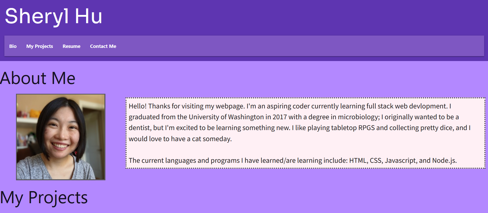

# Using Advanced CSS to Create a Responsive Personal Portfolio Webpage - UPDATED

## Description 

Portfolios are an essential for any coder when it comes to showing potential employers your skills and how you've used them. Webpages are a common method of building portfolios - this is a webpage I've built as my own to use as a hub for applications I've made and will make. 

Because this is a webpage, standard HTML and CSS were used to build it. However, in this modern day and age, mobile devices are incredibly common, and statistically have overtaken standard desktop devices in webpage browsing. This means that in order to maximize page viewership, webpages are all but required to be able to alter their appearances to suit different screen sizes, AKA responsive design. CSS can be used for this in the form of media queries and flexboxes, which give certain cues for pages to change their behavior as screen sizes change size. These behaviors can range from moving elements so they are more visually appealing as screens shrink to changing the page's colors so its contents are more readable. 

Within my own files for my page, I've created multiple flexboxes throughout the page so that text and images will appropriately wrap and change alignment and position as page sizes shift. This was the greatest challenge in building the portfolio: with so many different parts of the page, there was no single easy "cure all" template or checklist to adhere to so that each part would flex correctly. The flex properties of the image of the first showcased application are different from the properties of applications beneath it because they're sorted into separate "boxes", so the way they realign and change as screen size changes aren't identical. To this end, Google Chrome developer tools, specifically its responsive mode, were *extremely* helpful and a required tool needed to visualize flex behavior as well as pinpointing where changes needed to be made to correct strange repositioning and resizing. 

As part of an update to the page, I've incorporated the Materialize CSS library, Google Fonts, and the Font Awesome library to add some more interesting elements to the page. Materialize is used to simplify the use of flexboxes on the page and to provide some better style to certain elements of the page. Google Fonts was used to changed the font style, and the Font Awesome library provided icons for me to add to elements like links. 

## Technologies
- HTML5
- CSS3
- Chrome Developer Tools
- Materialize CSS
- Google Fonts 
- Font Awesome

### Image of Final Page

### Github Link for Application
[The link to the final product](https://reversedentistry.github.io/Sheryl-Hu-s-Portfolio-Website/)

